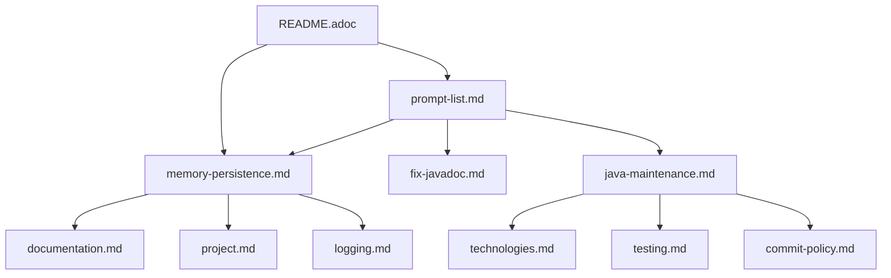

# LLM Rules Documentation Structure

## Document Types

### Process Definitions
Files that define specific workflows and procedures:
- `memory-persistence.md`: Process for updating documentation rules
- `java-maintenance.md`: Java code maintenance procedures
- `fix-javadoc.md`: Process for fixing Javadoc issues

### Rule Collections
Files containing specific rules and guidelines:
- `project.md`: Build and project structure rules
- `documentation.md`: Documentation standards
- `logging.md`: Logging conventions
- `technologies.md`: Technology standards
- `testing.md`: Testing requirements
- `commit-policy.md`: Commit message and process rules

### Command References
Files defining command structures and usage:
- `prompt-list.md`: Available Cascade Prompts and usage
- `README.adoc`: Overview and command documentation

## File Relationships



## Navigation Guidelines

1. Start with `README.adoc` for overview
2. Check `prompt-list.md` for available commands
3. Follow specific process files for workflows
4. Reference rule collections for implementation details

## Standard File Header Template
Each markdown file should follow this header structure:
```markdown
# [Title]

## Type: [Process|Rules|Reference]
## Related Files: [list of related files]
## Commands: [related cp commands]

## Overview
[content]
```

## Terminology

### Process Terms
- **Cascade Prompt (cp)**: Command prefix for all LLM operations
- **Memory**: Documentation rule or guideline
- **Persistence**: Process of updating documentation

### Rule Categories
- **Build Rules**: Maven and build process guidelines
- **Code Rules**: Java code standards
- **Documentation Rules**: Content and format standards
- **Testing Rules**: Test implementation requirements

## Maintenance

When updating documentation:
1. Follow `memory-persistence.md` process
2. Update related files (see relationships)
3. Maintain cross-references
4. Keep README.adoc current
